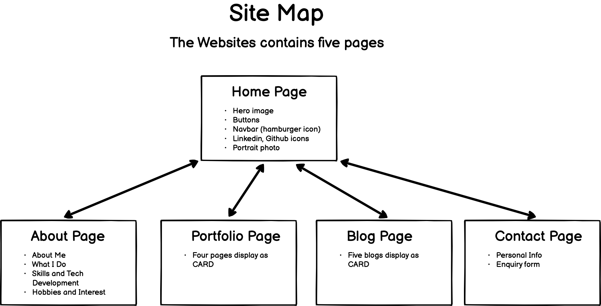

# A link (URL) to your published portfolio website

# A link to your GitHub repo

https://github.com/shaneqi72/portfolio_ShaneQi

# Description of your portfolio website, including:

## Purpose & Target Audience

Create a personal portfolio website to showcase my tech stack skills as a developer to target audience. THe target audience will be potential employer and organisation, and meetup group members. I would like to make audience think i would provide value to team and organizition after view this website.

## Functionality / features

I design and made this website base on the comcept of "clean, clear, minimalism, and attractive". There are four core elements across this website, which 'Good color scheme', 'Information Accessibility', 'Responsive Layout' and 'Attractive Component'.

Functionality:

-   Navbar manupilate to have audience easy to access information
-   Downloadble version resume is available for audience
-   Github and Linkedin are linked to this website for audience easy to access my personal repos and personal information

Features:

-   Attractive images have been used for improving visual effect
-   Identified Icons have been added onto it make component more visualised
-   Classical CARD display with hover effect
-   Blog has features of Model effect

## Sitemap

## Tech stack (e.g. html, css, deployment platform, etc)

HTML5, CSS3, SASS, Javascript, Git, Github, Netlify
